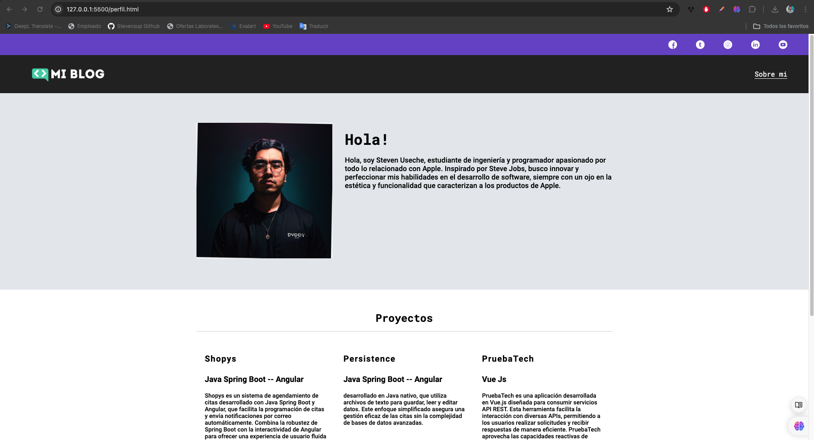

# Blog 
Este blog es el proyecto del HTML-CSS BLOG

## Comenzar 🛰
Para visualizar este proyecto lo unico que necesitas es descargar el .zip o hacer un fork del proyecto y abrir el archivo index.html.

## Instalación ⚙
    git clone XXX

## Pre-requisitos 📝
Lo único que necesitas sera tu editor de código preferido y tu mejor actitud.

## Preview

## Tecnologías 💻

 - HTML
 - CSS

## Autor 🙋🏼‍♂️

 - [Steven Useche Palomino](https://github.com/Stevensup)
 

1% Talento 🧠  99% Pasión 👨🏼‍💻❤️

